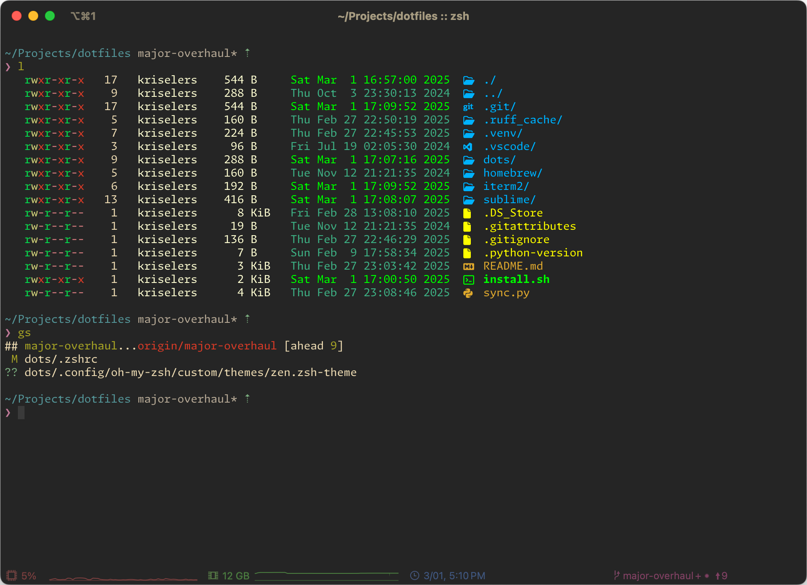

# Settings and Color Settings for iTerm2



If running `install.sh`, these commands are run automatically. If you're here
just to copy iTerm2 settings, then you'll run these yourself.

```bash
# Specify the preferences directory
defaults write com.googlecode.iterm2 PrefsCustomFolder -string "~/Projects/dotfiles/iTerm2/"

# Tell iTerm2 to use the custom preferences in the directory
defaults write com.googlecode.iterm2 LoadPrefsFromCustomFolder -bool true
```
