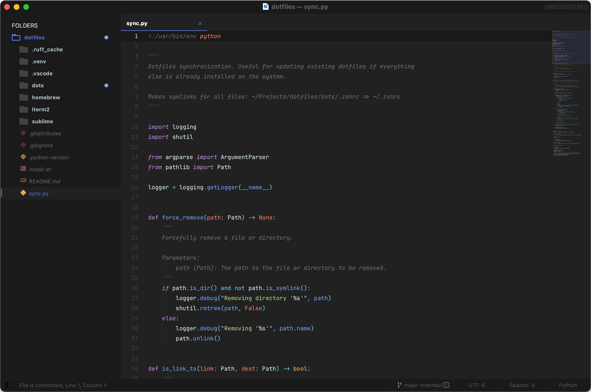

# Sublime Text Configuration

My lightweight configuration for Sublime Text. I don't use Sublime to build any
code rather as a fast way to view and make quick edits to files.



You must first ensure that
[Package Control](https://packagecontrol.io/installation) is installed.

## Installed Packages

- [A File Icon](https://packagecontrol.io/packages/A%20File%20Icon)
- [AutoFileName](https://packagecontrol.io/packages/AutoFileName)
- [BracketHighlighter](https://packagecontrol.io/packages/BracketHighlighter)
- [Git](https://packagecontrol.io/packages/Git)
- [GitGutter](https://packagecontrol.io/packages/GitGutter)
- [Material Theme](https://packagecontrol.io/packages/Material%20Theme)
- [SideBarEnhancements](https://packagecontrol.io/packages/SideBarEnhancements)
- [sublack](https://packagecontrol.io/packages/sublack)

## Useful Directories

### Where Package Control installs packages

- **MacOS**

  ```bash
  ~/Library/Application Support/Sublime Text/Installed Packages/Package
  ```

- **Windows**

  ```bash
  C:\Users\<user>\AppData\Roaming\Sublime Text\Installed Packages
  ```

### Where user settings are installed

- **MacOS**

  ```bash
  ~/Library/Application Support/Sublime Text/Packages/User
  ```

- **Windows**

  ```bash
  C:\Users\<user>\AppData\Roaming\Sublime Text\Packages\User\Package Control.sublime-settings
  ```
